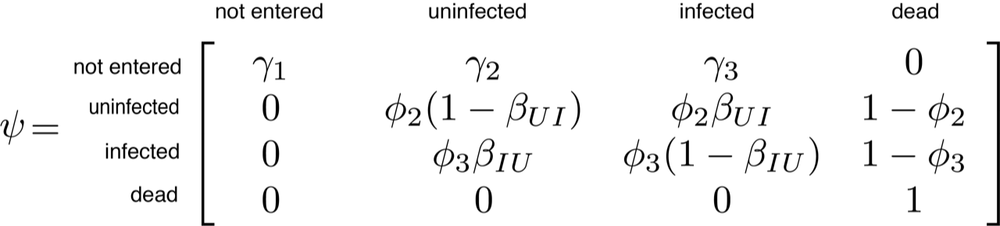

```{r setup, include=FALSE}
knitr::opts_chunk$set(echo = TRUE)
```

<br>

## Update the course material for this week

To update the course repository on your computer, you will ``pull`` a current copy of the repository. To do this: 

1.  Open your terminal/bash.

2.  Navigate to the course repository. If this is in your root directory then type:

    ```bash
    cd
    cd EEMB595TE
    ```
    
3.  Paste the following into the terminal/bash:

    ```bash
    git pull
    ```

<br>

## Last weeks objectives

(1) To learn the general principles of what occurs mathematically when you indicate a random effect

(2) To learn how to create a state-space model

<br>

## This weeks objectives

(1) Learn the differences between types of mark-recapture models

(2) 

<br>

### REVISED: Course schedule

```{r echo = FALSE}
library(knitr)
library(kableExtra)
cal <- read.csv("/Users/Cici/EEMB595TE/6_Multi-state_Mark_Recapture_Models/Calendar.csv")

cal %>%
  kable("html") %>%
  kable_styling()

```

**Everyone should have their presentations/code ready for 24 May 2018** 
**Either put it in a google drive file, drobox, box, or thumbdrive** 

## Presentation sign up sheet

Only 3 people have signed up- please do so as soon as possible. Presentations will start in 2 weeks from today.

```{r  out.width = "90%", echo = FALSE}
include_graphics("/Users/Cici/EEMB595TE/6_Multi-state_Mark_Recapture_Models/Class_sign_up.png") 
```

<br>

## Example of Multi-state systems

The example listed here are not all inclusive:

- Age structure: baby, juvenile, adult, dead

- Disease: infected, not infected, dead

- Movement: location A, location B, dead

- Sexual maturity: 

  - Fruiting adult, not fruiting adult, dead
  
  - Breeding adult, not breeding adult, dead
  
- Plant state: vegetative, flowering, dormant

## Types of Multi-state Mark-recapture models

These are the two most popular mark-recapture models are:

  - Cormack-Jolly-Seber Model (CJS)
    
  - Jolly-Seber Model (JS)
    
There are others:

  - But most of them stem from variations of these models

What parameters can you estimate using these two models?

| Cormack-Jolly-Seber Model | Jolly-Seber |
|---------------------------|------------|
| Survival ($\phi_{1}$)         | Survival ($\phi_{1}$) |           
| Survival ($\phi_{2}$)         | Survival ($\phi_{2}$) |           
| Transistion probability ($\psi_{1,2}$)| Transistion probability ($\psi_{1,2}$) |  
| Transistion probability ($\psi_{2,1}$)| Transistion probability ($\psi_{2,1}$) |  
|                             | Recruitment ($\gamma_{1}$) |  
|                             | Recruitment ($\gamma_{2}$) |  
|                             | Abundance (*N*) |  

What is the main difference between the CJS and JS models?

The Cormack-Jolly-Seber model disregards the data prior to the first encounter:

  - So it can not estimate recruitment
    
  - y = [0, 0, 0, 1, 1, 0, 0]

  - The model will start using information from the fourth season when the individual was captured (0 = not seen; 1 = seen)

The Jolly-Seber model uses the entire capture history:

  - So it can not estimate recruitment
    
  - y = [0, 0, 0, 1, 1, 0, 0]

  - The model will take advantage of the entire capture history- starting with the first season
        
    - It needs to determine was the organism present at the site and not seen (false negative) and if so- was this when it was recruited.
    
<br>

## Model assumptions

(1) Cormack-Jolly-Seber Model

  - The transition and observation probabilities must be the same for all individuals at a given occasion and state 
  
  - Individuals must be independent from one another
  
  - Individuals and states are recorded without error
  
    - If this is the case, look into multi-event models
      
  - No marks are lost
  
(2) Jolly-Seber Model

  - Same as the Cormack-Jolly-Seber model plus 2 more
  
  - The captured individuals are a random sample of the population
  
    - i.e., there is no trapping method does not affect the probability of recapturing

  - *All* individuals (marked and unmarked) in the population have the same capture probability
  
    - This is met when the same protocol is used each season

<br>

## Collecting data for animals that could be in one of 2 states

- State process: Unobserved (truth)

- Observed process: Observed (with sampling error)

```{r  out.width = "90%", echo = FALSE}
include_graphics("/Users/Cici/EEMB595TE/6_Multi-state_Mark_Recapture_Models/Fig7_1.png") 
```

- Where y = 1 (seen) and y = 0 (not seen)

- The observations for one individual would be:
  
  - y = [1, 1, 0, 1, 0, 0, 0]
  
- We need to determine if the individual for the last 3 sampling periods was dead or alive and not seen

- We monitor several individuals so the data we collect will look like this:

```{r echo = FALSE}
mat <- matrix(rbinom(50, 1, 0.7), ncol = 5, nrow = 10)
colnames(mat) <- c("Season1", "Season2", "Season3", "Season4", "Season5")
rownames(mat) <- 1:10
mat
```

<br>

## Collecting data for animals that could be in one of 3 states

- State process: Unobserved (truth)

- Observed process: Observed (with sampling error)

```{r  out.width = "90%", echo = FALSE}
include_graphics("/Users/Cici/EEMB595TE/6_Multi-state_Mark_Recapture_Models/Fig9_1.png") 
```

- Where y = 1 (seen in state 1), y = 2 (seen in state 2), and y = 0 (not seen)

  - You define and categorize what does state 1 equal and what does state 2 equal

- The observations for one individual would be:
  
  - y = [1, 2, 0, 1, 0, 0, 0]
  
- We need to determine if the individual for the last 3 sampling periods was dead or alive and not seen

- We monitor several individuals so the data we collect will look like this:

```{r echo = FALSE}
mat <- matrix(rmultinom(50, 2, c(0.3, 0.4, 0.3)), ncol = 5, nrow = 10)
colnames(mat) <- c("Season1", "Season2", "Season3", "Season4", "Season5")
rownames(mat) <- 1:10
mat
```

## Working exampling

We are interested in disease state of the chytrid fungus (infected or not infected) for amphibians.

```{r  out.width = "90%", echo = FALSE}
include_graphics("/Users/Cici/EEMB595TE/6_Multi-state_Mark_Recapture_Models/S_ilex.jpg") 
```

Data collection methods:
  
  - We go out 1 night for 10 years
  
  - We give individuals unique IDs (using toe clipping method)
  
  - We collect skin swab samples from individuals to determine in the lab the disease state

## Model outline

We denote the true but, unknowable, disease state of individual *i* at occasion *t* as $z_{i,t}$, where $z_{i,t} = 1\ldots4$ and represents the states "not entered", "uninfected", "infected", or "dead", respectively. To estimate monthly survival $(\phi)$, recruitment $(\gamma)$, and transition $(\beta)$ rates, we used the transition matrix $\psi$, where the cells represent the probabilities of moving from a row state to a column state from time *t-1* to time *t* for individual *i*.

<br><center>
<div style="width:525px; height=525px">

</center>
<br>

The “not entered” category consists of individuals that are not part of the population yet, where the parameters $\gamma_{2}$ and $\gamma_{3}$ are the state-specific entry probabilities for uninfected and infected hosts from *t-1* to *t*, i.e., the probability that an individual in state *i* enters the population at time *t*. The parameter $\phi_{2}$ and $\phi_{3}$ are the state-specific survival probability for uninfected  and infected hosts from *t-1* to *t*, while the parameters $\beta_{UI}$ and $\beta_{IU}$ are the infection and recovery probabilities, respectively. In other words, if the individual *i* survives from *t-1* to *t*, it can become infected if they were uninfected at *t-1*, or recover from infection if there were infected at time *t-1*, with probabilities $\beta_{UI}$ and $\beta_{IU}$. Each parameter must be between [0,1] and each group of parameters (recruitment, survival, and transition) must sum to 1. For survival and transition this is easy. However, for recruitment this is less straightforward. One solution is to choose a Dirichlet prior for $[\gamma_{1}, \gamma_{2}, \gamma_{3}]$ to ensure that these parameters sum to 1.

Because there are more than two possible true and observed states, we use the categorical distribution to model the transition from one state to another for individual *i* each time step:

$$z_{i,t} \mid z_{i,t-1} \sim \textrm{categorical}(\psi_{z_{i,t-1},1:4}),$$

where $\psi$ is the transition matrix we just defined. Note that the argument of the categorical distribution is a vector of length 4; that is, it is the row of the matrix $\psi$ corresponding to the state of individual *i* in time step *t-1*.

To estimate host recapture probabilities, we use a second transition matrix $\pi$, which determines the probabilities of the possible observation outcomes (columns) for the true state of each captured individual (rows). We do not assume partial observations or state misclassifications and the observed states are "seen uninfected", "seen infected", and "not seen".

<br><center>
<div style="width:400px; height=400px">

</center>
<br>

We use the categorical to model the observed state $y_{i,t}$ as a function of the true state:

$$y_{i,t} \mid z_{i,t} \sim \textrm{categorical}(\pi_{z_{i,t},1:3}),$$

where $\pi$ is the observation matrix we just defined.. Similarly as before, the argument of the categorical distribution is a vector of length 3; that is, it is the row of the matrix $\pi$ corresponding to the true state of individual *i* in time step *t*.

<br>

## Import our data and examine the data

```{r}
CH <- read.csv("/Users/Cici/EEMB595TE/6_Multi-state_Mark_Recapture_Models/Data/data_amphibian.csv")[,-1]
```

Look at the structure of the data and make sure it was imported correctly

```{r}
str(CH)
```

Remember our observations:
  - 0 = not seen
  - 1 = seen as uninfected
  - 2 = seen as infected

```{r}
head(CH)
```

## JAGS model

** Note that this code has a Bayesian posterior predictive check code and we will ignore it for now **

*Quick note the Bayesian posteriod predictive check or also known as the Bayesian p-value is used to evaluate how well does your data match predictions from the model you created. Values near 0.5 = well fitting model; whereas values near 0.95 and 0.05 = poor fitting model*

```{r}
{
sink("model_JS.txt")
cat("

model {
    
#--------------------------------------
# Parameters:
  # phi_U: survival probability of uninfected
  # phi_I: survival probability of infected
  # gamma_U: removal entry probability of uninfected
  # gamma_I: removal entry probability of infected
  # p_U: capture probability of uninfected
  # p_I: capture probability of infected
#--------------------------------------
# States (S):
  # 1 not yet entered
  # 2 uninfected
  # 3 infected
  # 4 dead
# Observations (O):
  # 1 seen as uninfected
  # 2 seen as infected
  # 3 not seen
#--------------------------------------
    
# Priors and constraints

phi_U ~ dunif(0, 1)   # Prior for mean survival
phi_I ~ dunif(0, 1)   # Prior for mean survival

for(t in 1:(K-1)){
  gamma_U[t] ~ dunif(0, 1)   # Prior for entry probabilities
  gamma_I[t] ~ dunif(0, 1)   # Prior for entry probabilities
}

p_U ~ dunif(0, 1)     # Prior for mean capture
p_I ~ dunif(0, 1)     # Prior for mean capture

beta_UI ~ dunif(0, 1)
beta_IU ~ dunif(0, 1)

# Define state and observation matricies
for(i in 1:M){  
    for(t in 1:(K-1)){
      # Define probabilities of state S(t+1) given S(t)
      # This is the psi matrix from above

        ps[1,i,t,1] <- 1 - gamma_U[t] - gamma_I[t]
        ps[1,i,t,2] <- gamma_U[t]
        ps[1,i,t,3] <- gamma_I[t]
        ps[1,i,t,4] <- 0

        ps[2,i,t,1] <- 0
        ps[2,i,t,2] <- phi_U * (1 - beta_UI)
        ps[2,i,t,3] <- phi_U * beta_UI
        ps[2,i,t,4] <- 1 - phi_U

        ps[3,i,t,1] <- 0
        ps[3,i,t,2] <- phi_I * beta_IU
        ps[3,i,t,3] <- phi_I * (1 - beta_IU)
        ps[3,i,t,4] <- 1 - phi_I

        ps[4,i,t,1] <- 0
        ps[4,i,t,2] <- 0
        ps[4,i,t,3] <- 0
        ps[4,i,t,4] <- 1

# This is the pi matrix from above

        po[1,i,t,1] <- 0
        po[1,i,t,2] <- 0
        po[1,i,t,3] <- 1

        po[2,i,t,1] <- p_U
        po[2,i,t,2] <- 0
        po[2,i,t,3] <- 1 - p_U

        po[3,i,t,1] <- 0   
        po[3,i,t,2] <- p_I 
        po[3,i,t,3] <- 1 - p_I

        po[4,i,t,1] <- 0
        po[4,i,t,2] <- 0
        po[4,i,t,3] <- 1
    } #t
} #i

#------ Likelihood model

for (i in 1:M){
  # Define latent state at first occasion
    z[i, 1] <- 1   
    # Make sure that all M individuals are in state 1 at t = 1; not entered
  
  for (t in 2:K){
    # State process: draw S(t) given S(t-1)
      z[i,t] ~ dcat(ps[z[i,t-1], i, t-1, ])

    # Observation process: draw O(t) given S(t)
      y[i,t] ~ dcat(po[z[i,t], i, t-1, ])
   }
  }


#------ Calculate derived population parameters fro recruitment

for (t in 1:(K-1)){
  qgamma_U[t] <- 1-gamma_U[t]
  qgamma_I[t] <- 1-gamma_I[t]
}

cprob_U[1] <- gamma_U[1]
cprob_I[1] <- gamma_I[1]

for (t in 2:(K-1)){
  cprob_U[t] <- gamma_U[t] * prod(qgamma_U[1:(t-1)])
  cprob_I[t] <- gamma_I[t] * prod(qgamma_I[1:(t-1)])
} #t

psi_U <- sum(cprob_U[])            # Inclusion probability
psi_I <- sum(cprob_I[])            # Inclusion probability

for (t in 1:(K-1)){
  b_U[t] <- cprob_U[t] / psi_U      # Entry probability
  b_I[t] <- cprob_I[t] / psi_I      # Entry probability
} #t

for (i in 1:M){
  for (t in 2:K){
    al_U[i,t-1] <- equals(z[i,t], 2)
    al_I[i,t-1] <- equals(z[i,t], 3)
  } #t
  for (t in 1:(K-1)){
    d_U[i,t] <- equals(z[i,t] - al_U[i,t], 0)
    d_I[i,t] <- equals(z[i,t] - al_I[i,t], 0)
  } #t   
  alive[i] <- sum(al_U[i,], al_I[i,])
} #i

for (t in 1:(K-1)){
  N_U[t] <- sum(al_U[,t])        # Actual population size
  N_I[t] <- sum(al_I[,t])        # Actual population size
  B_U[t] <- sum(d_U[,t])         # Number of entries
  B_I[t] <- sum(d_I[,t])         # Number of entries
} #t

for (i in 1:M){
  w[i] <- 1-equals(alive[i],0)
} #i

Nsuper <- sum(w[])            # Superpopulation size

#---------------- Calculate Bayesian posterior predictive check
#for(t in 1:(K-1)){
#  for(i in 1:M){
#    for(s in 1:state){
#      for(j in 1:n.surv)
#        r[s, i, t, j]     <- ifelse(y[i, t+1, j] == s, 1, 0)
#        r.new[s, i, t, j] <- ifelse(y.new[i, t+1, j] == s, 1, 0)
#      }
#    }
#  }
#}
#
#for(t in 1:(K-1)){
#  for(s in 1:state){
#    # sum across individuals in each state, each time period
#      R_state[s, t]     <- sum(r[s, , t, ])
#      R_state.new[s, t] <- sum(r.new[s, , t, ])
#  }
#}
#
#for(t in 1:(K-1)){
#  for(s in 1:state){
#    for(i in 1:M){
#      for(j in 1:n.surv)
#
#      muy[i, j, t, s] <-  ps[z[i, t], i, t, z[i, t+1]] * 
#                          po[z[i, t], i, t, j, s]
#      } 
#    }
#    PO_expt[s, t] <- sum(0.01, sum(muy[ , , t, s]))
#  }
#}
#
##--------- Posterior predictive check
#
#for(t in 1:(K-1)){
#  for(s in 1:state){
#    E.act[s, t] <- pow(pow(R_state[s, t], 0.5) - pow(PO_expt[s, t], 0.5), #2)
#    E.new[s, t] <- pow(pow(R_state.new[s, t], 0.5) - pow(PO_expt[s, t], 0#.5), 2)
#  }
#}
#
#zzz.fit <- sum(E.act[,])
#zzz.fit.new <- sum(E.new[,])

}
",fill = TRUE)
sink()
}
```

## Bundle the data

```{r}
# Analysis of the JS model as a multistate model

# Augment data approach allows us to estimate the total population size
# Idea = add a large number of 0 capture histories, and then the model will determine if those individuals were missed or do not exit using information from the detection probability and recruitment rates
nz <- 500

# Format the data with an added dummy column
# Dummy column = 1st column is all 1s
# Allows the model to calculate recrutiment into the population for the first season

CH.ms <- array(0, dim = c(dim(CH)[1]+nz, dim(CH)[2]+1))

for(i in 1:dim(CH)[1]){
  for(j in 1:dim(CH)[2]){
      CH.ms[i,j+1] <- CH[i, j]
  }
}

CH.du <- CH.ms[1:dim(CH)[1],]

# Recode CH matrix: a 0 is not allowed in JAGS!
CH.ms[CH.ms==0] <- 3    # Not seen = 3, seen = 1 or 2

# Bundle data
jags.data <- list(y = CH.ms, 
                  M = dim(CH.ms)[1],
                  K = dim(CH.ms)[2],
                  n.surv = 1,
                  state = 3
)

# Initial values
ch <- CH.du

js.multistate.init <- function(ch, nz){
# 4 state system
    # 1 = Not entered
    # 2 = uninfected
    # 3 = infected
    # 4 = Dead 
  
# 3 observation states
    # seen uninfected
    # seen infected
    # not seen

# Put an NA when an individual was not seen ( = 0 or 3)
  ch[ch==0] <- NA
  ch[ch==3] <- NA
  
  state <- ch
  colnames(state) <- 1:dim(state)[2]
  
  # When the individual is known to be alive between first and last capture fill it in with 2s
  for(i in 1:dim(ch)[1]){    # For each individual

    n1 <- min(which(ch[i,] < 3))
    n2 <- max(which(ch[i,] < 3))
    
    fill <- which(is.na(state[i,n1:n2]) == TRUE)
    state[i, names(fill)] <- 2
  }
  state <- state + 1
  
  f <- array(NA, dim = c(dim(ch)[1]))
  
    for(i in 1:dim(ch)[1]){
        f[i] <- min(which(!is.na(ch[i, ])))
    }

  l <- array(NA, dim = c(dim(ch)[1]))
  
  for(i in 1:dim(ch)[1]){
      l[i] <- max(which(!is.na(ch[i, ])))
  }

  for (i in 1:dim(ch)[1]){
# Before initial observation- not observed
    state[i,1:(f[i]-1)] <- 1
    
      # If the last time the animal was seen != the last survey date
      # Then add 1 to the survey date, and fill the rest to the last occasion with 4
      if(l[i]!= dim(ch)[2]){state[i, (l[i]+1):dim(ch)[2]] <- 4}
    
      if(ch[i, f[i]] == 1){state[i, f[i]] <- 2}
      if(ch[i, f[i]] == 2){state[i, f[i]] <- 3} 
    }
 
  state2 <- array(NA, dim = c(dim(ch)[1]+nz, dim(ch)[2]))
  state3 <- array(NA, dim = c(dim(ch)[1]+nz, dim(ch)[2]))

# Copy over the matrix you generated to the one with the right dimensions    
  for(i in 1:dim(ch)[1]){
    for(j in 1:(dim(ch)[2])){
        state2[i,j] <- state[i, j]
      }
    }

  # For all the data augmented individuals- their state == 1
  for(i in (dim(state)[1]+1):dim(state2)[1]){ 
    for(j in 1:(dim(state)[2])){ # For all occasions
        state2[i,j] <- 1
    }
  }  
  
  return(state2)
}

n.occasions <- dim(CH.ms)[2]

zinit <- js.multistate.init(CH.du, nz)

zinit <- apply(zinit, c(1, 2), max)
zinit[,1] <- NA


#--- Bundle the inits 

inits <- function(){list(phi_U = runif(1, 0.5, 1), 
                         phi_I = runif(1, 0.5, 1), 
                         
                         p_U = runif(1, 0.5, 1), 
                         p_I = runif(1, 0.5, 1), 
                         
                         beta_UI = runif(1, 0, 0.5),
                         beta_IU = runif(1, 0, 0.5),
                         
                         gamma_U = rep(runif(1, 0, 0.5), times = n.occasions-1), 
                         gamma_I = rep(runif(1, 0, 0.5), times = n.occasions-1),
                         
                         z = zinit
                         )}    

#------- Parameters monitored

params <- c("phi_U", 
            "phi_I", 
            "p_U", 
            "p_I",
            "beta_UI",
            "beta_IU",
            "gamma_U",
            "gamma_I")

#------- MCMC settings

ni <- 1000
nb <- 100
nt <- 10
nc <- 3
na <- 100

#------ call Library
library("jagsUI")

#------- Call JAGS from R

js.ms <- jags(data = jags.data, inits = inits, parameters.to.save = params, model.file = "model_JS.txt", n.chains = nc, n.thin = nt, n.iter = ni, n.burnin = nb, n.adapt = na, parallel = TRUE)

print(js.ms, dig = 3)
```

## Check the chains

```{r fig.width=9, fig.height=8, tidy=TRUE, echo=TRUE, include=TRUE, eval = TRUE}
plot(js.ms)
```

## Check the parameters from the model with the truth 

**The data set we used was actually simulated! We know the truth!**

```{r echo = FALSE}

n.occasions <- dim(CH)[2]

#--- Define parameter values
# Uninfected survival probability
phi_U <- 0.9
# Infected survival probability
phi_I <- 0.8

# Entry probability     
  # Must sum to one across all sampling ocassions
  # With n.occasions, n.occasions entry probability must be defined
gamma_U <- (1/(n.occasions))/4
gamma_I <- (1/(n.occasions))/4
 
# Transition probability 
beta_UI <- 0.5  # Going from Uninfected to Infected
beta_IU <- 0.2  # Going from Infected to Uninfected

# Detection probability
p_U <- 0.8  # Uninfected host
p_I <- 0.6  # Infected host

#--- Define parameter values
true <- c(phi_U, 
          phi_I, 
          p_U,
          p_I,
          beta_UI,
          beta_IU,
          
          rep(gamma_U, times = n.occasions), 
          rep(gamma_I, times = n.occasions)
          )

names <- c("Survival Uninfected", 
          "Survival Infected", 
          "Detection Uninfected",
          "Detection Infected",
          "Transmission: U to I",
          "Recovery: I to U",
          paste("Recruit U T", 1:(n.occasions), sep = ""), 
          paste("Recruit I T", 1:(n.occasions), sep = "")
          )

names <- factor(names, levels = names)

mod.mean <- c(
              js.ms$mean$phi_U,
              js.ms$mean$phi_I,
              js.ms$mean$p_U,
              js.ms$mean$p_I,
              js.ms$mean$beta_UI,
              js.ms$mean$beta_IU,
              js.ms$mean$gamma_U,
              js.ms$mean$gamma_I
              )

mod.q2.5 <- c(
  js.ms$q2.5$phi_U,
  js.ms$q2.5$phi_I,
  js.ms$q2.5$p_U,
  js.ms$q2.5$p_I,
  js.ms$q2.5$beta_UI,
  js.ms$q2.5$beta_IU,
  js.ms$q2.5$gamma_U,
  js.ms$q2.5$gamma_I
  )

mod.q97.5 <- c(
  js.ms$q97.5$phi_U,
  js.ms$q97.5$phi_I,
  js.ms$q97.5$p_U,
  js.ms$q97.5$p_I,
  js.ms$q97.5$beta_UI,
  js.ms$q97.5$beta_IU,
  js.ms$q97.5$gamma_U,
  js.ms$q97.5$gamma_I
)

dat <- data.frame(names = names, true = true, mod.mean = mod.mean, mod.q2.5 = mod.q2.5, mod.q97.5 = mod.q97.5)


library(ggplot2)

cols <- c("Truth" = "red", "Estimated" = "black")

ggplot(dat, aes(x= names, y=mod.mean, ymin=mod.q2.5, ymax=mod.q97.5))+ 
  geom_linerange(size = 1) +
  geom_point(size = 3, aes(x = names, y = mod.mean, col = "Estimated")) +
  geom_point(size = 3, aes(x = names, y = true, col = "Truth")) +
  scale_colour_manual("Values", values=cols)+
  geom_hline(yintercept = 0, lty=2) +
  coord_flip() + ylab('Parameter estimates') +
  xlab("Parameter names") +
  theme_bw()+ 
  theme(axis.text.x = element_text(size = 17, color = "black"), 
        axis.text.y = element_text(size = 17, color = "black"), 
        axis.title.y = element_text(size = 17, color = "black"), 
        axis.title.x =element_text(size = 17, color = "black"),
        legend.title =element_text(size = 17, color = "black"),
        legend.text =element_text(size = 17, color = "black"),
        panel.grid.major = element_blank(), 
        panel.grid.minor = element_blank()) 
```

